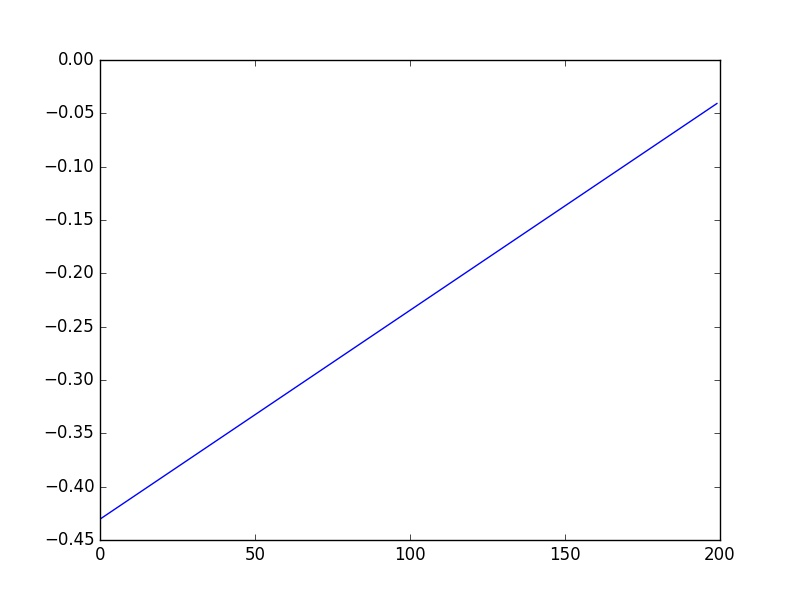
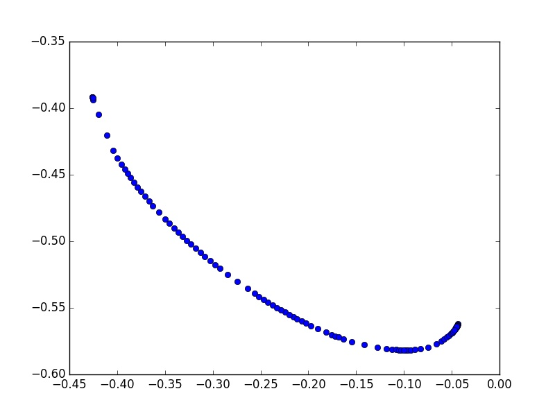

# 🚧 cpp_learning_from_demonstration 🚧

This repositroy C++ implementation of multi degrees of freedom trajectory learning using gaussian mixture model and gaussian mixture regression.

* A python implementation can be seen <a href="https://github.com/Marslanali/python-random-forest-decision-tree">here</a>.

## Introduction
This project addresses the the challenges of estimating the Quality of Experience (QoE) in encrypted traffic.Popular video providers such as YouTube, Netflix, Amazon Prime, and Vimeo have mostly encrypted videos traffic and this poses an additional challenges for network operator to perform essentials task as to inspect, compress or balance traffic.We used machine learning model to predict QoE from enctypted traffic. The decision tree & random forest classifier model is trained in python using scikit-learn library and then imported in C++ using python scikit-learn porter library. The proposed machine learning models in C++ were able to identify quality issues from unencrypted data with accuracy of 93.5% and from encrypted traffic with accuracy of 91.8%. 

## Data Representation
Let X is the data sets containing n features with n data points. Each row corresponds to a data point while each column depicts the feature. Similarly, y represents the labels ![f1] to ![f2].

## Training and Test Data	  
Let ![f3] is the data sets containing n features with n data points used for the training. Each row corresponds to a data point while each column depicts the feature. Similarly, ![f4] represents the labels ![f5] to ![f6] used for the training. 

Our goal is to train the model the ![f3] and ![f4] and then test it with ![f7] and ![f8] data. 

[f1]: http://chart.apis.google.com/chart?cht=tx&chl=y_0
[f2]: http://chart.apis.google.com/chart?cht=tx&chl=y_n
[f3]: http://chart.apis.google.com/chart?cht=tx&chl=X_{train}
[f4]: http://chart.apis.google.com/chart?cht=tx&chl=y_{train}
[f5]: http://chart.apis.google.com/chart?cht=tx&chl=y_0
[f6]: http://chart.apis.google.com/chart?cht=tx&chl=y_n
[f7]: http://chart.apis.google.com/chart?cht=tx&chl=X_{test}
[f8]: http://chart.apis.google.com/chart?cht=tx&chl=y_{test}

## Branches

```
├── [master]           git checkout master
├── [develop-youtube]  git checkout master
├── [develop-vimeo]    git checkout master
├── [develop-netflix]  git checkout master
├── [develop-prime]    git checkout master
└── [develop-disney]   git checkout master
```

## Files

```
.
├── src
├── include
├── test
├── CMakeList.txt
└── README.md
```
## Dependencies

* LAPACK (Linear Algebra Package)

* MLPACK (C++ Machine Learning Library)

* Armadillo (C++ library for linear algebra & scientific computing)

* Matplotlib-CPP (for plotting directly in c++) 

* Ubuntu 16.04/18.04, CMake/Make, GCC

## Demo

To build run the following command in terminal:

```bash
$ mkdir build
$ cd build
$ cmake ..
$ make 
```

```bash
$ ./unit-testing --mean 1000 --sigma 500 --distance 200
```

<p align="left">
     
   
  <br/>
  Fig. 1. Input Data
</p>


<p align="left">
  
  
  <br/>
  Fig. 2. Input Clock and, GMM Centroids
</p>


## Miscellaneous

[Armadillo Installation](http://arma.sourceforge.net/download.html)

[Armadillo Installation](http://arma.sourceforge.net/download.html)

[Armadillo Installation](http://arma.sourceforge.net/download.html)

[Armadillo Installation](http://arma.sourceforge.net/download.html)

## References

[Random Forest ](https://www.researchgate.net/publication/308020680_The_k-means_clustering_technique_General_considerations_and_implementation_in_Mathematica/link/584dd9be08aeb989252647ac/download)

[Decision Trees ](https://www.researchgate.net/publication/308020680_The_k-means_clustering_technique_General_considerations_and_implementation_in_Mathematica/link/584dd9be08aeb989252647ac/download)

[Decision Trees ](https://www.researchgate.net/publication/308020680_The_k-means_clustering_technique_General_considerations_and_implementation_in_Mathematica/link/584dd9be08aeb989252647ac/download)

[Decision Trees ](https://www.researchgate.net/publication/308020680_The_k-means_clustering_technique_General_considerations_and_implementation_in_Mathematica/link/584dd9be08aeb989252647ac/download)

[Data for example code] The data folder contains the test data which constitutes of 4 demonstrations. The collected demonstratiosn consists of cartesian trajectories of 3 DOF robot.


## To-Do List

- :ballot_box_with_check: Refactor src/include with clang
- :negative_squared_cross_mark: Add CMake Cross Platform Support
- :negative_squared_cross_mark: Add Docker Image Support 


Author:
_Arslan Ali_


